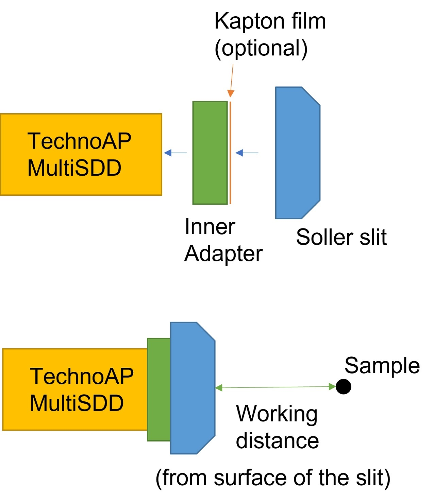

# TAP-MSDD-Slit
3D model data of Soller slit and Adapter for [TechnoAP Multi-SDD system](http://www.techno-ap.com/seihin.html#sddsystem).  

All 3d models have been made by [DesignSpark Mechanical](https://www.rs-online.com/designspark/mechanical-software).

## License

All materials are usable under [Apache-2.0 license](https://www.apache.org/licenses/LICENSE-2.0).  

## File list

* TAP7SDD_40mmSlit : Soller slit for 7-elements SDD, working distance = 40 mm.
* TAP7SDD_20mmSlit : Soller slit for 7-elements SDD, working distance = 20 mm.

* TAP7SDD_SlitAdapter : Inner adapter for Soller slit. (not supplied at beta release)

* JigFor40mmSlit : Jig for sample position adjustment, length = 40 mm.
* JigFor20mmSlit : Jig for sample position adjustment, length = 20 mm.

## Usage

---

2021 KEK-PhotonFactory and S.Noguchi